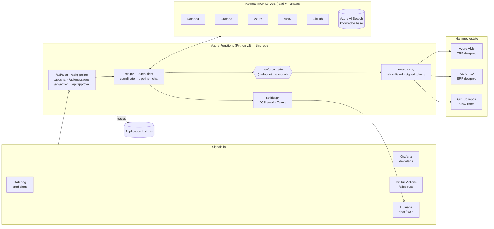

# DevOps Commander 🛡️

> **Autonomous SRE for a multi-cloud ERP.** An Azure Functions–hosted AI agent fleet that watches a real Azure + AWS workload, diagnoses incidents and CI/CD failures from *real* telemetry, and proposes **human-gated** fixes — delivered as one-click Approve/Reject emails.

This is the **brain** of the AI-103 capstone. It is a single Python (v2) Function App that hosts a fleet of [Microsoft Foundry](https://learn.microsoft.com/azure/ai-foundry/) prompt agents. The agents ground every conclusion in the team's existing observability and cloud control planes through **official remote MCP servers** (Datadog, Grafana, Azure, AWS, GitHub) plus an Azure AI Search knowledge base, and they can act on the world only through a deterministic, allow-listed, human-approved executor.

The workload it watches lives in two sibling repos ([`ERP_System`](#related-repositories) + [`ERP_Infra`](#related-repositories)); the Azure runtime that hosts this app is provisioned by [`DevOps-Commander-Infra`](#related-repositories).

---

## What it does

| Capability | How |
|------------|-----|
| **Incident RCA** | A monitoring alert (Datadog prod / Grafana dev) hits `POST /api/alert`. The coordinator agent reads metrics, logs and VM/EC2 state, confirms the real cause, and emails a structured root-cause report. |
| **Self-healing CI/CD** | A failed GitHub Actions run calls `POST /api/pipeline`. The triage agent reads the *real* workflow run, job logs and file contents via the GitHub MCP, finds the **exact** error, and emails a one-click fix that commits to a new branch, opens a PR, and re-runs the pipeline. |
| **ChatOps** | Humans ask questions in natural language via `POST /api/chat` or the embedded Web Chat bot. The chat agent can pull live dev data and propose actions. |
| **Human-gated remediation** | Every destructive action (restart VM/service, stop/reboot EC2, open a fix PR) is minted as a **signed, single-use, expiring** approval token. Nothing runs until a human clicks Approve. |
| **Notifications** | Reports and approvals are delivered by **Azure Communication Services email** (rich HTML) and, when the bot is wired, a proactive **Teams** card — both sharing one approval token. |

### The golden rule

> **The model proposes; the code disposes.** A deterministic gate in [`rca.py`](rca.py) (`_enforce_gate`) — never the LLM — decides whether a fix may proceed, and the executor physically refuses to touch anything outside the **dev** environment and the repo allow-list.

---

## Architecture



---

## HTTP endpoints

| Method | Route | Auth | Purpose |
|--------|-------|------|---------|
| `POST` | `/api/alert` | `X-Alert-Token` | Datadog/Grafana webhook → incident RCA. |
| `POST` | `/api/pipeline` | `X-Pipeline-Token` (falls back to `X-Alert-Token`) | GitHub Actions failure → CI/CD triage + gated fix. |
| `POST` | `/api/chat` | `X-Chat-Token` | ChatOps: free-text question → agent answer (multi-turn via `conversation_id`). |
| `GET` | `/api/action` | `X-Chat-Token` | List the safe action allow-list (names only). |
| `POST` | `/api/action` | `X-Chat-Token` | Run one allow-listed action; destructive ones return an approval token (202). |
| `POST` | `/api/approve` | `X-Chat-Token` | Spend a token and run the approved action (API path). |
| `GET` | `/api/approval?token=…&decision=approve\|reject` | token *is* the bearer | One-click Approve/Reject from an email or Teams card. Returns an HTML page. |
| `POST` | `/api/messages` | Bot Framework (managed identity) | Web Chat / Teams channel endpoint. |
| `POST` | `/api/directline-token` | — | Mint a short-lived Direct Line token so a browser can open Web Chat without seeing the secret. |
| `GET` | `/api/health` | none | Liveness probe → `{"status":"ok"}`. |

---

## The agent fleet ([`rca.py`](rca.py))

Three named [Foundry prompt agents](https://learn.microsoft.com/azure/ai-foundry/) are invoked through the Responses API (keyless — the Function App's user-assigned managed identity with the *Azure AI User* role):

| Agent | Trigger | Job |
|-------|---------|-----|
| `devops-commander-coordinator` | `/api/alert` | One-shot incident RCA. Confirms host up/down with `compute_vm_get` instance-view before ever calling an outage. |
| `devops-commander-pipeline` | `/api/pipeline` | CI/CD triage. Reads the real run → job logs → file contents and emits the exact compiler/test/dependency error + a concrete fix. |
| `devops-commander-chat` | `/api/chat`, `/api/messages` | Multi-turn ChatOps assistant with live dev read tools. |

### Grounding — remote MCP servers + RAG

Each tool is attached only when its app settings are present, so the fleet **degrades gracefully** to base reasoning when something isn't configured. Auth is supplied by Foundry *project connections* referenced by name (no secret is committed or placed in app settings).

| Server | Scope | Used for |
|--------|-------|----------|
| **Datadog** | read-only | prod metrics, monitors, logs, APM traces |
| **Grafana** | read-only | dev dashboards, Prometheus/Loki queries, alerts |
| **Azure** | manage | resource inventory, Monitor metrics/logs, resource health, VM start/stop/restart, run-command |
| **AWS** | manage | EC2/SSM/CloudWatch inventory + instance management |
| **GitHub** | **read-only** | workflow runs, job logs, file contents (diagnosis only — all writes happen in the executor behind approval) |
| **Azure AI Search** | RAG | ERP knowledge base: inventory, host↔resource mapping, prior incidents |

> ⚠️ **Diagnosis lesson baked in:** the GitHub MCP must expose the **`actions`** toolset (`get_workflow_run`, `list_workflow_jobs`, `get_job_logs`) or the agent can only see workflow YAML and will *hallucinate*. Use `GITHUB_MCP_URL=https://api.githubcopilot.com/mcp/x/all/readonly`. Server-side MCP tool calls are logged to App Insights (`mcp_call` / `mcp_list_tools` traces) for exactly this kind of observability.

---

## The executor ([`executor.py`](executor.py)) — the hands

A deterministic, security-first action layer. Every guard that matters lives here, not in the HTTP edge or the model:

- **Allow-list only.** Unknown actions are refused.
- **Dev-only blast radius.** Cloud actions physically refuse any environment but `dev`; the managed identity's custom RBAC role is scoped to run-command on the dev VMs alone.
- **Signed approvals.** Destructive actions (`restart_service`, `restart_vm`, `start_vm`, `stop_vm`, `stop_ec2`, `reboot_ec2`, `delete_customer`, `fix_pipeline`) return an HMAC-signed, expiring, single-use token. Approval spends the nonce so it can never run twice.
- **CI/CD writes are split-token + repo-scoped.** The read PAT lives in the Foundry GitHub MCP connection (diagnosis); a separate write PAT in `GITHUB_EXEC_TOKEN` (the executor) creates the branch/commit/PR/re-run — and only against repos on `GITHUB_REPO_ALLOWLIST`.

---

## Configuration reference (app settings)

Everything is opt-in; absence disables the matching feature gracefully.

| Setting | Purpose |
|---------|---------|
| `ALERT_SHARED_SECRET` | Shared secret for `/api/alert` (and fallback for pipeline/chat). |
| `PIPELINE_SHARED_SECRET` | Optional dedicated secret for `/api/pipeline`. |
| `CHAT_SHARED_SECRET` | Optional dedicated secret for chat/action/approve routes. |
| `AZURE_AI_PROJECT_ENDPOINT` | Foundry project endpoint. Without it, all AI features are dormant. |
| `AZURE_OPENAI_DEPLOYMENT` | Model deployment name (default `gpt-4o`). |
| `DATADOG_MCP_URL` / `DATADOG_MCP_CONNECTION` | Datadog MCP server + Foundry connection name. |
| `GRAFANA_MCP_URL` (or `GRAFANA_URL`) / `GRAFANA_MCP_CONNECTION` | Grafana MCP server + connection. |
| `AZURE_MCP_URL` / `AZURE_MCP_CONNECTION` | Azure MCP server (+ optional auth connection). |
| `AWS_MCP_URL` / `AWS_MCP_CONNECTION` | AWS MCP server (+ optional auth connection). |
| `GITHUB_MCP_URL` / `GITHUB_MCP_CONNECTION` | GitHub MCP (read-only) + connection holding the **read** PAT. |
| `GITHUB_EXEC_TOKEN` | **Write** PAT used by the executor to open fix PRs. Unset ⇒ no Approve button (graceful). |
| `GITHUB_REPO_ALLOWLIST` | Comma-separated `owner/repo` the executor may write to. |
| `AZURE_AI_SEARCH_INDEX` / `AZURE_AI_SEARCH_CONNECTION_ID` / `AZURE_AI_SEARCH_QUERY_TYPE` | Knowledge-base RAG tool. |
| `AZURE_SUBSCRIPTION_ID` / `AZURE_TENANT_ID` | Real subscription/tenant the agents target (never hardcoded). |
| `ACS_CONNECTION_STRING` / `NOTIFY_FROM` / `NOTIFY_TO_EMAILS` | Azure Communication Services email sender + recipients. |
| `PUBLIC_BASE_URL` / `WEBSITE_HOSTNAME` | Base URL used to build signed approval links. |
| `DIRECTLINE_SECRET` | Direct Line secret exchanged for browser Web Chat tokens. |
| `MicrosoftAppId` / `MicrosoftAppType` / `MicrosoftAppTenantId` | Bot Framework identity (secretless, managed-identity). |

---

## Repository layout

```
DevOps-Commander/
├─ function_app.py        # HTTP edge: all routes, auth, JSON shaping
├─ rca.py                 # the agent fleet, MCP tools, RAG, code gate
├─ executor.py            # allow-listed actions, signed approvals, fix-PR engine
├─ notifier.py            # ACS email + Teams; rich HTML report rendering
├─ bot.py                 # Bot Framework adapter (Web Chat / Teams)
├─ observability.py       # live dev reads (App Insights / Log Analytics)
├─ tools/                 # seed_knowledge.py, export_logs.py (RAG corpus)
├─ teams-app/             # Teams app manifest + icons
├─ infra/                 # AWS exec policy, Azure MCP container manifest
├─ requirements.txt
└─ .github/workflows/
   └─ deploy-function.yml # build → deploy → smoke test → notify-on-failure
```

---

## Deploy

Infrastructure is provisioned first by [`DevOps-Commander-Infra`](#related-repositories). Then:

1. Run that repo's **Provision** workflow to create the Function App and supporting resources.
2. Copy the `function_app_name` Terraform output into this repo as the **repository variable** `FUNCTION_APP_NAME`.
3. Run the **Deploy Function** workflow here (`workflow_dispatch`). It compiles the source, vendors `manylinux2014` cp311 wheels into `.python_packages`, deploys, and smoke-tests `/api/health`.
4. Configure the MCP/connection/notification app settings above (most are seeded by Terraform).

### Self-healing hook

The deploy workflow ([`deploy-function.yml`](.github/workflows/deploy-function.yml)) ends with a `notify-failure` job (`if: failure()`) that POSTs the failed run's coordinates to this app's own `/api/pipeline` — so the system **triages its own pipeline**. The same hook is wired into `DevOps-Commander-Infra` and `ERP_Infra`.

---

## Local development

```powershell
cp local.settings.json.example local.settings.json   # fill in secrets
func start
```

Smoke-test the webhook:

```powershell
curl -X POST http://localhost:7071/api/alert `
     -H "Content-Type: application/json" `
     -H "X-Alert-Token: change-me-locally" `
     -d '{"alert":"test"}'
```

## Observability

Every server-side MCP tool call, agent retry, gate decision and notification is logged to **Application Insights**. Useful queries:

```kusto
// What the agent actually called (server-side MCP tools)
traces
| where timestamp > ago(30m)
| where message has "mcp_call where" or message has "mcp_list_tools"
| order by timestamp asc
| project timestamp, message
```

```kusto
// Every alert received
traces
| where message startswith "alert_received "
| extend p = parse_json(substring(message, strlen("alert_received ")))
| project timestamp, source = tostring(p.source), alert = p.payload
| order by timestamp desc
```

> Tip: query App Insights with `az monitor app-insights query --app <appId> --analytics-query "..." -o json` — `-o table` can render blank even when rows exist.

---

## Related repositories

| Repo | Role |
|------|------|
| [`DevOps-Commander-Infra`](https://github.com/PixelTech-Solutions/DevOps-Commander-Infra) | Terraform for the Azure AI runtime that hosts this app (Function App, Foundry, App Insights, ACS, Bot, AI Search). |
| [`ERP_System`](https://github.com/PixelTech-Solutions/ERP_System) | The monitored workload — a real Spring Boot + React + MySQL ERP with chaos endpoints. |
| [`ERP_Infra`](https://github.com/PixelTech-Solutions/ERP_Infra) | Terraform + Ansible that stand up the ERP servers on Azure VMs and AWS EC2. |
